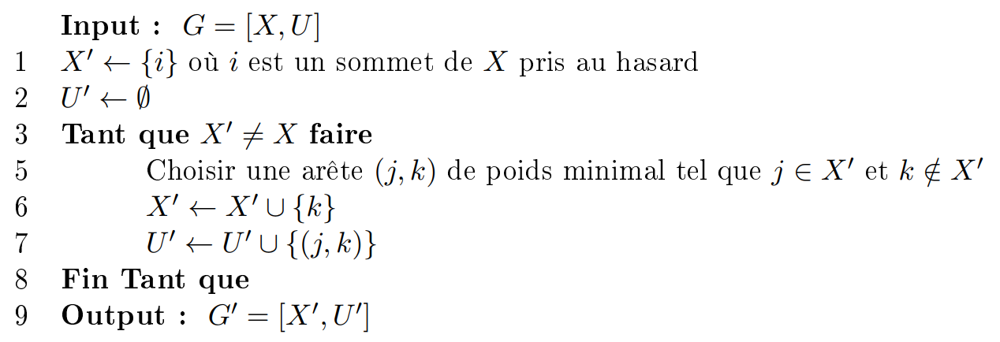
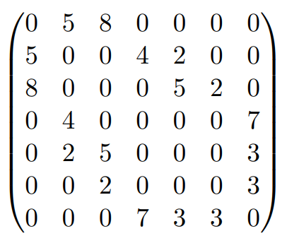
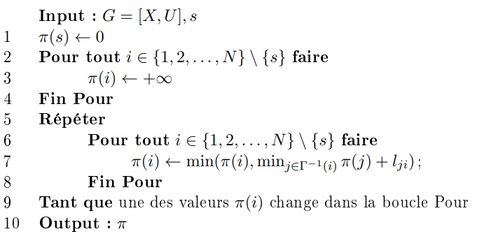
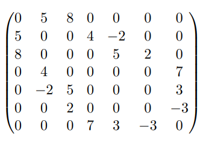
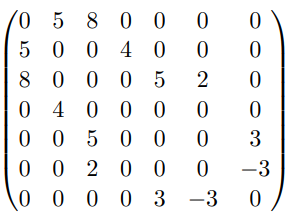
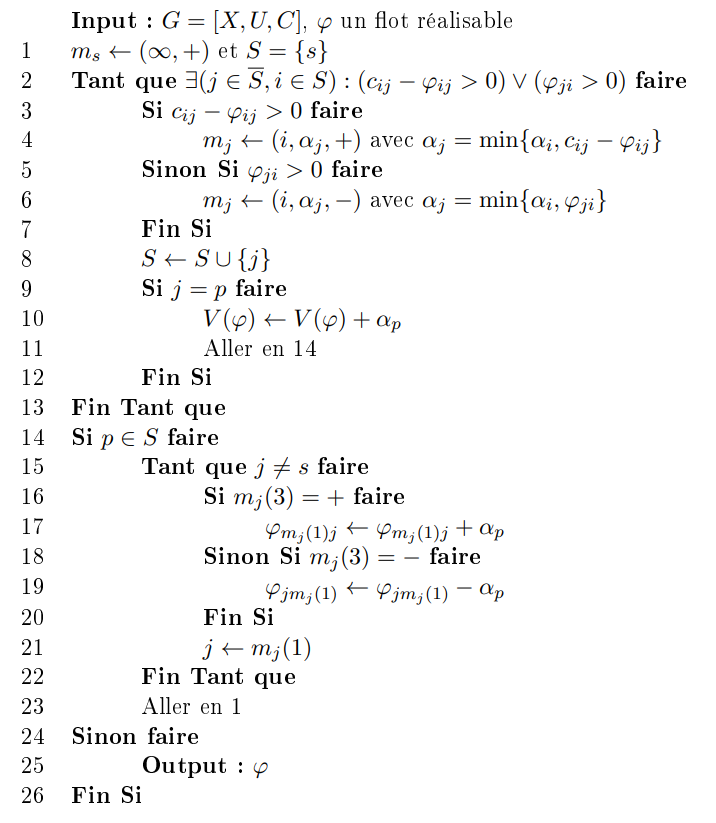
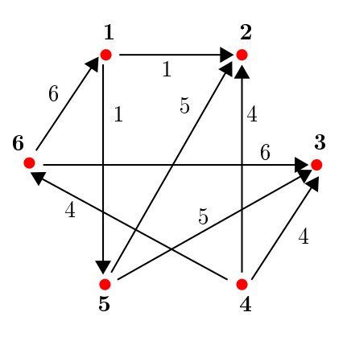

# Présentation

Ce rapport présente le travail que nous avons effectué lors de notre projet, notre objectif était de traduire le pseudo-code de
plusieurs algorithmes de théorie des graphes en langage R.  
Il s'agit des algorithmes de _**Prim**_,  de _**Ford-Bellman**_ ainsi que de _**Ford-Fulkerson**_.

- _**Prim**_: Calcul d'un arbre couvrant minimal dans un graphe valué non orienté.  
- _**Ford-Bellman**_: Calcul des plus courts chemins depuis un sommet source dans un graphe valué orienté.  
- _**Ford-Fulkerson**_: Calcul du flot maximal d'un graphe à partir d'un sommet source et d'un sommet puit dans un graphe valué orienté.  


Pour chaque algorithme vous trouverez une description, un pseudo-code, une implémentation en code R ainsi qu'un ou plusieurs exemples.

\vspace{30pt}

\tableofcontents

```{r, echo=FALSE}
library("rstudioapi")
setwd(dirname(getActiveDocumentContext()$path))
source('functions.R')
```
\newpage
# Algorithme de Prim

## Description

Soit un graphe G valué non orienté, on y cherche un arbre couvrant minimal _(Minimum Spanning Tree)_.
Cet algorithme consiste, à partir d'un sommet aléatoire, à trouver un ensemble d'arête de G formant un arbre de telle sorte
à ce que la somme des poids de ces arêtes soit minimale.  
On part donc de ce sommet pris au hasard puis on construit petit à petit notre arbre en trouvant, à chaque étape, une arête de poids minimal
ayant exactement un sommet en commun avec notre arbre en construction. Une fois tous les sommets présents dans l'arbre, l'algorithme
a fini son travail.  
Le calcul d'un arbre couvrant minimal peut s'appliquer différents domaine, notamment le domaine de la téléphonie, où il est important
de pouvoir relier toutes les villes par un réseau de câble en une distance minimale (ne pas repasser deux fois au même endroit, etc.)

## Pseudo-Code

{width=500}

## Code R
\footnotesize
```{r}
Prim = function(X, A)
{
  "
  INPUT:
    X : Liste des sommets du graphe
    A : Matrice d'adjacence du graphe
  OUTPUT:
    visited : Liste chronologique des sommets rajoutés à l'arbre
    mst : Liste des arêtes de l'arbre couvrant minimal
  "
  visited = c(sample(X,1)) # Initialisation de la liste des sommets visités par un sommet pris au hasard
  mst = c() # Initialisation de notre Minimum Spanning Tree
  edges = which(A!=0, arr.ind=T) # Récupération des arêtes à partir de notre matrice d'adjacence
  
  while(length(visited) != length(X)) {
    possible = list() # Liste des arêtes possibles
    for (node in visited) {
      neighbours = edges[which(edges[,'row']==node), 'col'] # On récupère la liste des voisins d'un noeud
      neighbours = neighbours[which(!(neighbours %in% visited))] # On prend uniquement ceux qui ne sont pas visités
      for (neighbour in neighbours) {
        possible[[length(possible)+1]] = c(node, neighbour) # On les ajoute à la liste des arêtes possibles
      }
    }
    minval = Inf # On itialise un minimum à l'infini
    cursor = c() # Variable utilisée pour contenir notre arête minimale
    for (edge in possible) { # Pour chaque arête possible
      # Si sa valeur est inférieure au minimum stocké, on met le curseur dessus et on change le minimum
      if (A[edge[1], edge[2]] < minval) {
        minval = A[edge[1], edge[2]]
        cursor = edge
      }
    }
    visited = append(visited, cursor[2]) # On ajoute notre nouveau noeud visité
    mst = append(mst, paste(cursor[1],'-',cursor[2], sep="")) # On ajoute l'arête possible minimale à notre arbre
  }
  return(list(visited, mst))
}
```
\normalsize

## Exemple

Soit un graphe G avec X la liste de ses sommets et A sa matrice d'adjacence représentée ci-dessous :

```{r, echo=FALSE, fig.align="center", out.width="120pt"}

```

```{r, echo=FALSE}
X =  c(1,2,3,4,5,6,7)
A1 = c(0,5,8,0,0,0,0)
A2 = c(5,0,0,4,2,0,0)
A3 = c(8,0,0,0,5,2,0)
A4 = c(0,4,0,0,0,0,7)
A5 = c(0,2,5,0,0,0,3)
A6 = c(0,0,2,0,0,0,3)
A7 = c(0,0,0,7,3,3,0)
A = rbind(A1,A2,A3,A4,A5,A6,A7)
```
```{r}
Prim(X, A)
```
Ici on a en premier la liste de nos sommets ajoutés dans l'ordre chronologique.  
En deuxième valeur de retour, nous avons la liste des arêtes qui constitue notre arbre.

\newpage
# Algorithme de Ford-Bellman

## Description

Soit un graphe G valué orienté, on cherche à calculer le plus court chemin d'un sommet donné vers tous les autres sommets du graphe.
Pour ce faire, l'algorithme va créer un tableau de distances qu'il initialisera à l'infini pour tous nos sommets excepté le sommet d'origine
qui sera initialisé à zéro.  
Il va ensuite parcourir le graphe et mettre à jour au fur et à mesure notre tableau de distances. Si ce tableau ne change pas entre deux
itérations, alors le travail est terminé.  
Une des particularité de Ford-Bellman est qu'il est capable de détecter, ou non, la présence d'un cycle de poids négatif dans le graphe
qu'on lui a donné. Cependant, dans ce pseudo-code, nous n'avons pas ce système de détection. Ainsi, s'il y a réellement un cycle de poids
négatif, notre algorithme pourra ne jamais finir de s'éxecuter. (cf. exemple n°1 et n°2)  
Le problème de plus court chemin est rencontré dans plusieurs domaines également, notamment dans le calcul d'un chemin le plus court
possible entre deux villes qu'un GPS effectue. Il est également utilisé dans des algorithmes de pathfinding pour l'intelligence
artificielle avec notamment l'algorithme A*.


## Pseudo-Code

{width=400}


## Code R
\footnotesize
```{r}
Ford_Bellman = function(vertices, adjacency, source)
{
  "
  INPUT:
    vertices : Liste des sommets du graphe
    adjacency : Matrice d'adjacence du graphe
    source : Sommet à partir duquel on calcule les plus courts chemins
  OUTPUT:
    dist : Tableau de distances minimales à partir de source
  "
  dist = c()
  end = FALSE
  edges = which(adjacency!=0, arr.ind=T) # Récupération des arêtes à partir de notre matrice d'adjacence
  
  for (i in vertices) { # Pour chaque sommet du graphe
    dist[i] = Inf # On initialise sa distance au sommet source à l'infini
  }
  dist[source] = 0 # On met la distance du sommet source à zéro
  
  while(!end)
  {
    end = TRUE # Flag utilisé pour arrêter la boucle
    for (i in vertices[-source])
    {
      pred = unname(edges[which(edges[,'col']==i),'row']) # Liste des prédecesseurs du sommet i
      if (length(pred) > 0) # Si le sommet a un prédecesseur
      {
        for (j in pred) # Pour chaque prédecesseur de i
        {
          weight = dist[j] + adjacency[j,i] # On calcule un nouveau poids pour notre sommet i
          if (weight < dist[i]) # Si le poids est inférieur à son poids actuel
          {
            dist[i] = weight # La distance de i est mise à jour
            end = FALSE # Si on modifie dist, alors on arrête pas la boucle
          }
        }
      }
    }
  }
  return(dist)
}
```
\normalsize

## Exemple n°1
Soit un graphe G avec X la liste de ses sommets et B sa matrice d'adjacence représentée ci-dessous :

```{r, echo=FALSE, fig.align="center", out.width="120pt"}

```

```{r, echo=FALSE}
X =  c( 1, 2, 3, 4, 5, 6, 7)
B1 = c( 0, 5, 8, 0, 0, 0, 0)
B2 = c( 5, 0, 0, 4,-2, 0, 0)
B3 = c( 8, 0, 0, 0, 5, 2, 0)
B4 = c( 0, 4, 0, 0, 0, 0, 7)
B5 = c( 0,-2, 5, 0, 0, 0, 3)
B6 = c( 0, 0, 2, 0, 0, 0,-3)
B7 = c( 0, 0, 0, 7, 3,-3, 0)
B = rbind(B1,B2,B3,B4,B5,B6,B7)
```
```{r}
#Ford_Bellman(X, B, sample(X,1))
```
Dans cette exemple nous n'aurons pas de sortie, puisque la fonction ne finira jamais de s'éxécuter. En effet dans ce graphe on a
deux cycles de poids négatif : celui entre les sommets 2 et 5 ainsi que celui entre les sommets 6 et 7.  
Ainsi, peu importe le choix du sommet d'origine, notre algorithme se perd dans ce cycle et ne finit jamais de s'éxécuter.

## Exemple n°2
Soit un graphe G avec X la liste de ses sommets et C sa matrice d'adjacence représentée ci-dessous :

```{r, echo=FALSE, fig.align="center", out.width="120pt"}

```

```{r, echo=FALSE}
X =  c( 1, 2, 3, 4, 5, 6, 7)
C1 = c( 0, 5, 8, 0, 0, 0, 0)
C2 = c( 5, 0, 0, 4, 0, 0, 0)
C3 = c( 8, 0, 0, 0, 5, 2, 0)
C4 = c( 0, 4, 0, 0, 0, 0, 0)
C5 = c( 0, 0, 5, 0, 0, 0, 3)
C6 = c( 0, 0, 2, 0, 0, 0,-3)
C7 = c( 0, 0, 0, 0, 3,-3, 0)
C = rbind(C1,C2,C3,C4,C5,C6,C7)
```
```{r}
Ford_Bellman(X, C, 7)
```
Ici nous récupérons un tableau qui contient la distance minimale entre le sommet 7 et chacun des autres sommets.  
Dans ce graphe, l'éxecution ne fonctionne que pour les sommets 6 et 7 puisqu'il y a un cycle de poids negatif entre ces deux sommets : 
en effet notre sommet source fait partie de ce cycle, l'algorithme n'y passera pas.

\newpage
# Algorithme de Ford-Fulkerson

## Description

Soit un graphe G valué orienté, on cherche à y trouver un flot réalisable maximal depuis un sommet source jusqu'à un sommet puit.
Pour cela, l'algorithme de Ford-Fulkerson va initialiser un flot nul puis va réaliser des itérations, dans lesquels il essaiera de trouver une chaîne de sommet telle qu'elle améliore notre flot actuel.
Dans cette recherche de châine améliorante, l'algorithme va marquer chaque arc avec un flot, qui ne peut excéder la capacité de cet arc.
D'un sommet ne peut sortir qu'un flot inférieur ou égal à la somme de tous les flots qu'il a reçu. Ainsi si un sommet 3 reçoit les valeurs 4 et 7 de la part des sommets 1 et 2, il devra en sortir, au maximum, la valeur 11 (4+7).  
Cet algorithme s'arrête lorsqu'il ne trouve pas de nouvelle châine améliorante entre deux itérations.  
Le problème de flot maximum s'applique, par exemple, dans des sociétés de transports où la capacité maximale serait la quantité de
marchandises que peut contenir un véhicule et la source et le puit seraient les entrepôts de départ et d'arrivée.

## Pseudo-Code

{width=400}
\newpage

## Code R

\footnotesize
```{r}
Ford_Fulkerson = function(vertices, adjacency, src, dst)
{
  "
  INPUT:
    vertices : Liste des sommets du graphe
    adjacency : Matrice d'adjacence du graphe
    src : Sommet de départ de notre recherche de flot maximal
    dst : Sommet puit (destination)
  OUTPUT:
    maxFlow : Valeur du flot maximal pour les inputs donnés
  "
  maxFlow = 0 # Maximum flow (return value)
  edges = which(adjacency!=0, arr.ind=T) # Matrix of edges (row->col)
  
  flot = matrix(0, nrow=length(vertices), ncol=length(vertices)) # Flow matrix initialized to 0
  
  search = TRUE # Flag used for the 'GoTo Line 1'
  while(search) {
    
    mark = list() # Initializing a marking list
    mark[[src]] = c(-1, Inf, 1) # Initialize source mark (-1 for no predecessor, 1 for positive)
    S = c(src) # Used to store our visited vertices
    S_cache = c() # Vector used for a check at the end of the while(TRUE) part
    
    # First part of the pseudo-code, going from our source vertex to our destination
    stop=FALSE # Flag used for the 'GoTo Line 14'
    while(TRUE) # Used to repeat, we'll exit this loop with break statements
    {
      reloadS=FALSE # Flag used to come back here if the S vector has been changed and need to be considered by the for loop
      for (j in setdiff(X,S)) # For each node not in S
      { 
        # Store all of j's neighbours that are in S
        iTab = intersect(union(edges[which(edges[,'col']==j), 'row'], edges[which(edges[,'row']==j), 'col']), S) 
        for (i in iTab) # For each vertex in iTab
        { 
          cij = adjacency[i,j] # cij is the edge capacity
          aij = flot[i,j] # aij is our current flow for the ij edge
          aji = flot[j,i] # aji is our current flow for the ji edge
          if ((cij - aij > 0) | (aji > 0)) # If there is something to do about the edge flow
          { 
            if (cij - aij > 0) # If positive
            { 
              aj = min( c( mark[[i]][2], cij-aij ) ) # j flow equals the minimum between i flow and cij-aij
              mark[[j]] = c(i, aj, 1) # We update j mark (i the used predecessor, aj the flow, 1 for positive)
            }
            else if (aji > 0) # If negative
            { 
              aj = min( c( mark[[i]][2], aji ) ) # j flow equals the minimum between i flow and aji
              mark[[j]] = c(i, aj, -1) # We update j mark (i the used predecessor, aj the flow, -1 for negative)
            }
            S = append(S, j) # We add j to the visited vertices
            reloadS = TRUE # Now we need to exit the for loop so it considers that we changed S
            if (j == dst) # If j is out destination
            {
              maxFlow = maxFlow + mark[[dst]][2] # We increment the maxFlow by j's flow
              stop=TRUE # Now we need to exit the while(TRUE)
            }
          }
          if(stop | reloadS) {break} # Flags IF statement
        }
        if(stop | reloadS) {break} # Flags IF statement
      }
      # If S hasn't changed between 2 iterations, it means we couldn't reach the destination, so we exit
      if(identical(S, S_cache)) {break} else {S_cache=S} 
      if(stop) {break} # Flags IF statement
    }
    
    # Second part of the pseudo-code, updating our edges flow and retracing path
    if (dst %in% S) # If our destination is in S
    {
      while(j != src)
      {
        if(mark[[j]][3] == 1) # If j mark is positive
          flot[mark[[j]][1],j] = flot[mark[[j]][1],j] + mark[[dst]][2] # Update our flow matrix
        
        else if (mark[[j]][3] == -1) # If j mark is negative
          flot[j,mark[[j]][1]] = flot[j,mark[[j]][1]] - mark[[dst]][2] # Update our flow matrix
        
        j = mark[[j]][1] # Change j to its predecessor
      }
    }
    else {search = FALSE} # If he's not, we end the algorithm
  }
  return(maxFlow)
}
```
\normalsize

## Exemple

Soit un graphe G avec X la liste de ses sommets, D sa matrice d'adjacence et sa représentation graphique ci-dessous :

```{r, echo=FALSE, fig.align="center", out.width="150pt"}

```

```{r, echo=FALSE}
X  = c(1,2,3,4,5,6)
D1 = c(0,1,0,0,1,0)
D2 = c(0,0,0,0,0,0)
D3 = c(0,0,0,0,0,0)
D4 = c(0,4,4,0,0,4)
D5 = c(0,5,5,0,0,0)
D6 = c(6,0,6,0,0,0)
D = rbind(D1,D2,D3,D4,D5,D6)
```
```{r}
Ford_Fulkerson(X, D, 4, 2)
```
Dans notre exemple nous prenons le sommet 4 comme source et le sommet 2 comme puit.  
L'algorithme nous retourne donc le flot maximal qu'il est possible de faire passer dans ce graphe lorsque nous partons
du sommet 4 pour arriver au sommet 2.

\newpage

# Conclusion

Ce projet aura été pour nous une occasion de travailler sur des algorithmes de théorie des graphes qui résolvent des problèmes
que l'on peut rencontrer dans bien des domaines aujourd'hui.  
Traduire des pseudo-codes n'est pas une tâche facile mais ce travail nous aura permis de nous y entraîner, dans un langage que nous
ne pratiquons que trop rarement.  
La principale difficulté étant de comprendre et de retranscrire un pseudo-code qui n'est bien souvent pas adapté à un langage comme R,
nous avons pris du temps afin de trouver des méthodes qui pouvaient reproduire de manière efficace ce qu'il nous était demandé.  
Par exemple, les instructions comme 'Aller à la ligne x' ou bien les boucles qui contiennent beaucoup de conditions difficiles à vérifier
ont été plus longues à implémenter, surtout celles de Ford-Fulkerson.  
Il est évidemment possible d'améliorer notre code en trouvant des manières plus intelligentes de gérer ces boucle qu'avec des flags.  
Mise à part cet élément, nous sommes contents du résultat et de ce que cela nous a apporté.  
Nous espérons que vous avez apprécié la lecture de ce rapport.

