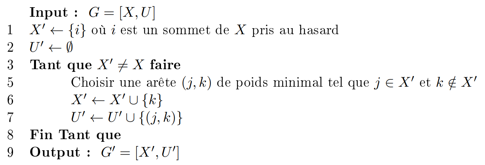
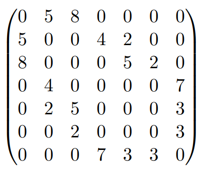
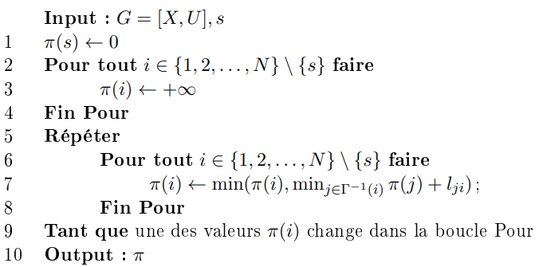
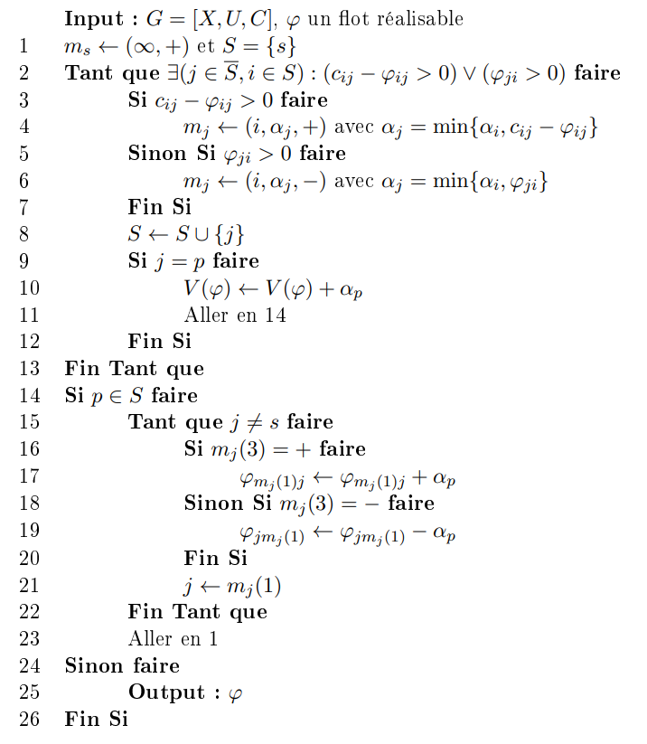

# Présentation

Ce rapport présente le travail que nous avons effectué lors de notre projet, notre objectif étant de traduire le pseudo-code de
plusieurs algorithmes de théorie des graphes en langage R.  
Il s'agit des algorithmes de _**Prim**_,  de _**Ford-Bellman**_ ainsi que de _**Ford-Fulkerson**_.

- _**Prim**_: Calcul d'un arbre couvrant minimal dans un graphe valué non orienté.  
- _**Ford-Bellman**_: Calcul des plus courts chemins depuis un sommet source dans un graphe valué orienté.  
- _**Ford-Fulkerson**_: Calcule le flot maximal d'un graphe à partir d'un sommet source et d'un sommet puit dans un graphe valué orienté.  


\vspace{20pt}
```{r, echo=FALSE}
library("rstudioapi")
setwd(dirname(getActiveDocumentContext()$path))
source('functions.R')
```
\newpage
# Algorithme de Prim

## Description

Soit un graphe G valué non orienté, on y cherche un arbre couvrant minimal _(Minimum Spanning Tree)_.
Cet algorithme consiste, à partir d'un sommet aléatoire, à trouver un ensemble d'arête de G formant un arbre de telle sorte
à ce que la somme des poids de ces arêtes soit minimale.  
On part donc de ce sommet pris au hasard puis on construit petit à petit notre arbre en trouvant, à chaque étape, une arête de poids minimal
ayant exactement un sommet en commun avec notre arbre en construction. Une fois tous les sommets présents dans l'arbre, l'algorithme
a fini son travail.

## Pseudo-Code

{width=500}

## Code R
\footnotesize
```{r}
Prim = function(X, A) {
  visited = c(sample(X,1)) # Initialisation de la liste des sommets visités par un sommet pris au hasard
  mst = c() # Initialisation de notre Minimum Spanning Tree
  edges = which(A!=0, arr.ind=T) # Récupération des arêtes à partir de notre matrice d'adjacence
  
  while(length(visited) != length(X)) {
    possible = list() # Liste des arêtes possibles
    for (node in visited) {
      neighbours = edges[which(edges[,'row']==node), 'col'] # On récupère la liste des voisins d'un noeud
      neighbours = neighbours[which(!(neighbours %in% visited))] # On prend uniquement ceux qui ne sont pas visités
      for (neighbour in neighbours) {
        possible[[length(possible)+1]] = c(node, neighbour) # On les ajoute à la liste des arêtes possibles
      }
    }
    minval = Inf # On itialise un minimum à l'infini
    cursor = c() # Variable utilisée pour contenir notre arête minimale
    for (edge in possible) { # Pour chaque arête possible
      # Si sa valeur est inférieure au minimum stocké, on met le curseur dessus et on change le minimum
      if (A[edge[1], edge[2]] < minval) {
        minval = A[edge[1], edge[2]]
        cursor = edge
      }
    }
    visited = append(visited, cursor[2]) # On ajoute notre nouveau noeud visité
    mst = append(mst, paste(cursor[1],'-',cursor[2], sep="")) # On ajoute l'arête possible minimale à notre arbre
  }
  return(list(visited, mst))
}
```
\normalsize

## Exemple

Soit un graphe G avec X la liste de ses sommets et A sa matrice d'adjacence représentée ci-dessous :

```{r, echo=FALSE, fig.align="center", out.width="150pt"}

```

```{r, echo=FALSE}
X =  c(1,2,3,4,5,6,7)
A1 = c(0,5,8,0,0,0,0)
A2 = c(5,0,0,4,2,0,0)
A3 = c(8,0,0,0,5,2,0)
A4 = c(0,4,0,0,0,0,7)
A5 = c(0,2,5,0,0,0,3)
A6 = c(0,0,2,0,0,0,3)
A7 = c(0,0,0,7,3,3,0)
A = rbind(A1,A2,A3,A4,A5,A6,A7)
```
```{r}
Prim(X, A)
```
Ici on a en premier la liste de nos sommets ajoutés dans l'ordre chronologique.  
En deuxième valeur de retour, nous avons la liste des arêtes qui constitue notre arbre.

\newpage
# Algorithme de Ford-Bellman

## Description

## Pseudo-Code

{width=400}

## Code R

## Exemple

\newpage
# Algorithme de Ford-Fulkerson

## Description

## Pseudo-Code

{width=400}

## Code R

## Exemple